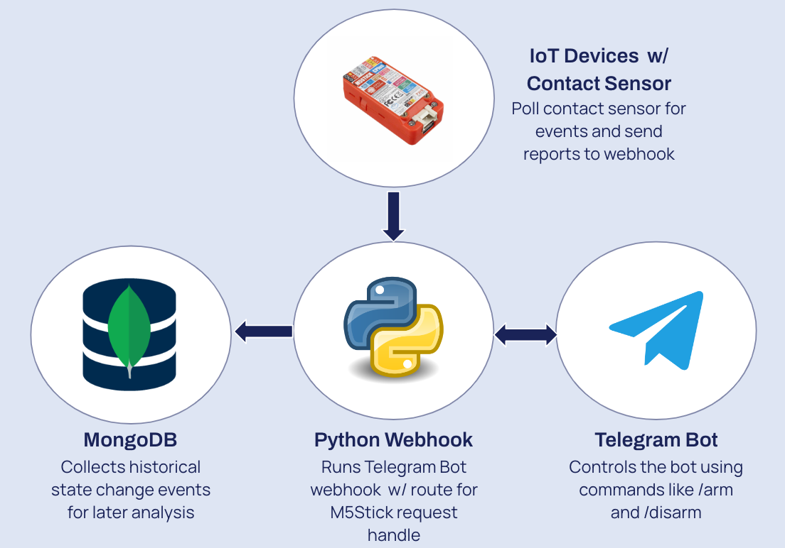
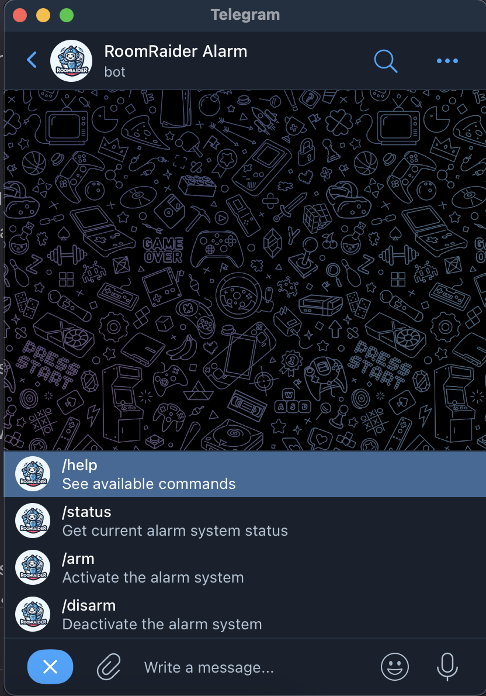
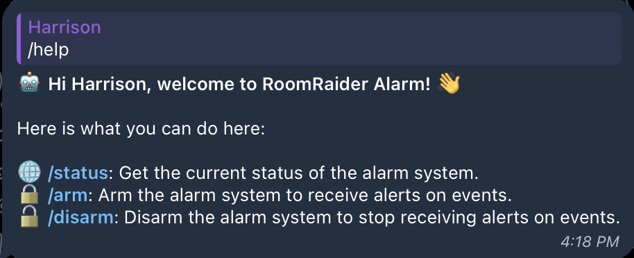
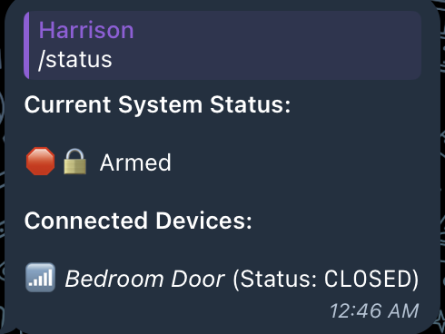
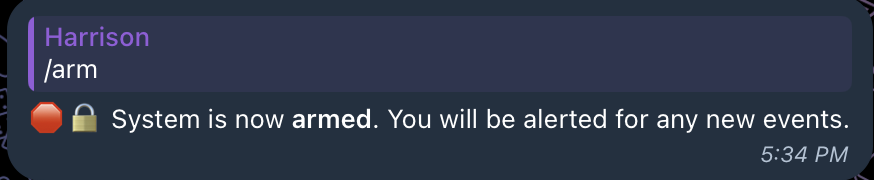
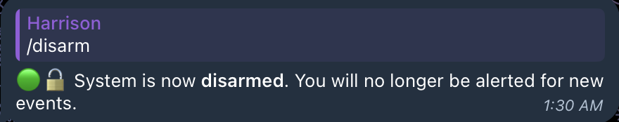
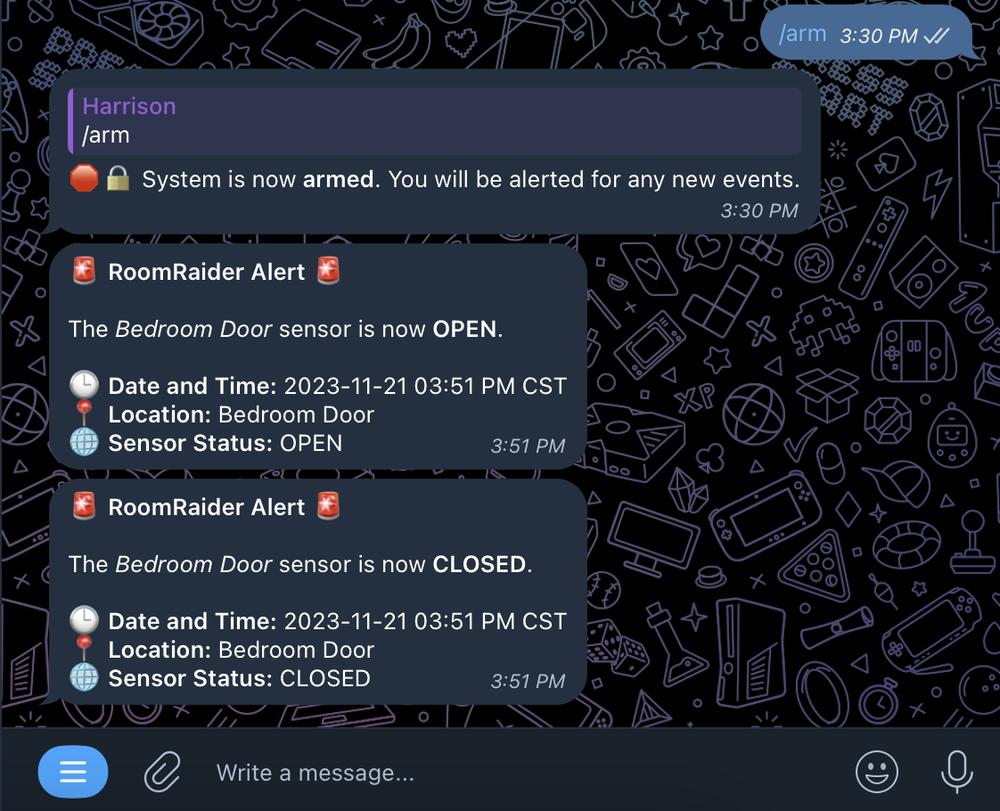

<div align="center">
    
    <h1>RoomRaider - IoT Contact Sensor Alarm System</h1>
</div>

RoomRaider is a project that I completed for the UT Austin MSITM Emerging Technologies IoT class. This system uses an [M5StickCPlus](https://shop.m5stack.com/products/m5stickc-plus-esp32-pico-mini-iot-development-kit) with a contact sensor, the [Telegram Bot API](https://core.telegram.org/bots/api), [MongoDB](https://www.mongodb.com/), and an [aiohttp webhook](https://docs.aiohttp.org/en/stable/web_quickstart.html#run-a-simple-web-server) to act as an alarm system that allows the user to create a network of multiple contact sensor devices that send updates and push alerts to users when the system is armed.

This system can be used to monitor any physical connections that can be monitored by a contact sensor (e.g. a door, a window, refrigerator, cabinet, etc.). The system is designed to be modular and can be easily expanded to monitor multiple locations with multiple devices. The limitations of the system are the battery of the IoT device, the range of the wifi connection, and the feasibility of the IoT device's sensor to be mounted on a surface. 

<details>
    <summary><b>Table of Contents</b></summary>
    <ol>
        <li><a href="#system-components">System Components</a></li>
        <ol>
            <li><a href="#python-webhook">Python Webhook</a></li>
            <li><a href="#telegram-bot">Telegram Bot</a></li>
            <li><a href="#setup">MongoDB</a></li>
            <li><a href="#iot-devices">IoT Devices</a></li>
        </ol> 
        <li><a href="#setup">Setup</a></li>
        <ol>
            <li><a href="#pre-requisites">Pre-requisites</a></li>
            <li><a href="#telegram-bot-setup">Telegram Bot Setup</a></li>
            <li><a href="#mongodb-setup">MongoDB Setup</a></li>
            <li><a href="#server-setup">Server Setup</a></li>
            <li><a href="#m5stickcplus-device-setup">M5StickCPlus Device Setup</a></li>
            <li><a href="#test-the-connection">Test the Connection</a></li>
        </ol> 
        <li><a href="#demo">Demo</a></li>
    </ol> 
</details>

## System Components



### Python Webhook

The [webhook](./server/) is a Python webserver that uses the [aiohttp](https://docs.aiohttp.org/en/stable/) library to listen for incoming requests from the Telegram Bot API and the IoT network. In my environment, the webhook is hosted on a Linux Ubuntu VPS running in the cloud. The webhook has two primary functions:

1. **It is used to receive updates from the Telegram Bot API.**

    When users engage with the Telegram API by sending messages to the bot in the app, the Telegram API sends a POST request to the webhook with the message data. The webhook then parses the message data and sends a response back to the Telegram API.

2. **It acts as a REST API to interface with the IoT sensor devices.**

    The webhook has two actions exposed that allow the IoT devices to send updates to the server and receive information about the system. These actions are passed in the payload. The webhook uses the [aiohttp](https://docs.aiohttp.org/en/stable/) library to asynchrously listen for incoming requests from the IoT devices. When a request is received, the webhook parses the request data and sends a response back to the IoT device. It then processes the request data and updates the database accordingly.

    * `sensor_event` - Used by the IoT devices to send sensor updates to the server. The POST payload must follow this format from the sensor.

        ```
        {
            "action": "sensor_event",
            "timestamp": 1700188942,
            "location": "Bedroom Door",
            "sensor_status": "OPEN" or "CLOSED"
        }
        ```

    * `ping` - Used to verify that the server is running. Can be monitored by a service like UptimeRobot with the payload `{"action": "ping"}`.

3. **It is used to track the current state of the sensors & send alerts**

    The webhook stores the local state of all registered sensors via their "location" parameter in the cache. This implies that the "location" parameter for each sensor must be unique. 
    
    The webhook uses this cache to determine if a sensor has _changed state_ and sends a message to the user via the Telegram Bot API (only if the system is armed).

### Telegram Bot



The [Telegram Bot](https://t.me/M5StickDoorBot) is the primary interface for the user to interact with the system, and aims to be an intuitive solution for the user as opposed to a website or physical buttons on the device. This bot sends updates to the previously mentioned webhook via Telegram's servers when the user sends commands. The bot has the following commands as shown in the image above:

* `/help` - _Displays the help menu._

    

* `/status` - _Gets the current status of the system (armed or disarmed)._

    

* `/arm` - _Arms the system so that the user starts receiving alerts when the status of a sensor in the network changes._

    

* `/disarm` - _Disarms the system so that the user no longer receives system alerts._

    

When alerts are received, the bot sends a message to the user with the following format:



### MongoDB

The [MongoDB](https://www.mongodb.com/) database is used to store new system events. The database is hosted by their own cloud service, [MongoDB Atlas](https://www.mongodb.com/cloud/atlas). The database has one collection:

* `events` - Stores all events that are sent to the webhook from the IoT devices. The events are stored in the following format:

    ```
    {
        "_id": {"$oid":"655d20520805a48112b1e47f"}
        "action": "sensor_event",   <- Mandatory as sensor_event 
        "timestamp": "1700601938",  <- Unix timestamp of the event
        "location": "Bedroom Door", <- Unique identifier for the sensor
        "sensor_status": "CLOSED",  <- OPEN or CLOSED
        "system_status": "Armed"    <- Armed or Disarmed
    }
    ```

This feature was not necessary for the system to function, but was added to allow the user to view the history of the system. It could be used to generate insights like the average time that the system is armed, or the average time that a sensor is open, etc.

### IoT Devices

The IoT devices are the boards with contact sensors that are used to monitor the contact state of each location in the system. In my environment, I was using the [M5StickCPlus](https://shop.m5stack.com/products/m5stickc-plus-esp32-pico-mini-iot-development-kit) devices with an [Arduino Door Sensor](https://www.amazon.com/dp/B0B3D7BM4K?&linkCode=sl1&tag=zlufy-20&linkId=ebc9d95cfe52506a8cf7ff5ed3ea73d3&language=en_US&ref_=as_li_ss_tl) that are programmed using the [Arduino IDE](https://www.arduino.cc/en/software). The devices are programmed to send a POST request to the webhook when the state of the sensor changes. 

The system is designed to support any type of IoT device, as long as the `location` parameter is unique and the POST request payload matches the following format:

```
{
    "action": "sensor_event",
    "timestamp": 1700188942,
    "location": "Bedroom Door",
    "sensor_status": "OPEN" or "CLOSED"
}
```

## Setup

For the sake of documentation, I've included the steps that I took to setup the system in my environment. The system can be setup in any environment that supports the requirements listed below.

### Pre-requisites

* [Python 3.9+](https://www.python.org/downloads/)
* [MongoDB Atlas Account](https://www.mongodb.com/cloud/atlas)
* [Telegram Account](https://telegram.org/)
* [M5StickCPlus](https://shop.m5stack.com/products/m5stickc-plus-esp32-pico-mini-iot-development-kit)
* [Arduino Door Sensor](https://www.amazon.com/dp/B0B3D7BM4K?&linkCode=sl1&tag=zlufy-20&linkId=ebc9d95cfe52506a8cf7ff5ed3ea73d3&language=en_US&ref_=as_li_ss_tl)
* [Arduino IDE](https://www.arduino.cc/en/software)

### Telegram Bot Setup:

Before getting started, you will need to create a Telegram bot and get the **bot token**, as this is the primary interface for the user to interact with the system and also determines the webhook URL. 

The steps to create a bot and get the bot token are outlined here: https://medium.com/geekculture/generate-telegram-token-for-bot-api-d26faf9bf064

Make sure to save this token in a safe place for later.

### MongoDB Setup:

Before deploying the server, you will need to create a MongoDB Atlas account and create a new cluster. The steps to create a cluster are outlined here: https://docs.atlas.mongodb.com/tutorial/create-new-cluster/

The database should be named `et-final-project` and the collection should be named `events`.

You will need to get the full **connection string** for Python (e.g. `mongodb+srv://<USERNAME>:<PASSWORD>@<YOUR_CONNECTION>?retryWrites=true&w=majority`) to connection to the database and save this for later. 

### Server Setup

The core of the system is the Python webserver/webhook that uses the [aiohttp](https://docs.aiohttp.org/en/stable/) library to listen for incoming requests from the Telegram Bot API and the IoT network.

To setup this server, I first deployed a Linux Ubuntu VPS in the cloud:

1. **Create a new Ubuntu 22.04 LTS VPS on Linode**

    I chose Linode because they have the cheapest monthly hosting option for Ubuntu 22.04 LTS at $5 monthly.

    https://cloud.linode.com/linodes/create

2. **SSH into the VPS**

    ```
    ssh root@<ip_address>
    ```

3. **Open the firewall ports for the webhook**

    ```
    sudo ufw enable
    sudo ufw allow ssh
    sudo ufw allow 443
    ```

    Then restart the server

    ```
    sudo reboot
    ```

4. **Install Python 3.9+ and pip**

    https://docs.python-guide.org/starting/install3/linux/

5. **Clone the repository**

    ```
    git clone https://github.com/hschickdevs/RoomRaider-IoT-Alarm.git

    cd RoomRaider-M5Stick-Alarm/
    ```

6. **CD in and Install the required Python packages**

    ```
    pip install -r requirements.txt
    ```

7. **Create a `.env` file with the required variables**

    See the [`.env.example`](.env.example) file for the required variables.

    ```
    cp .env.example .env
    ```

    Then modify accordingly

8. **Start the server**

    ```
    python3 -m server
    ```

    The server should now be running and listening for incoming requests from the Telegram Bot API and the IoT network. You should also now see logs being posted in the Telegram chat. 

### M5StickCPlus Device Setup

Since I used the M5StickCPlus device, I will outline the steps that I took to setup the device. If you are using a different device, you will need to find the appropriate libraries and setup instructions for your device.

1. **Open the Arduino IDE**

2. **Provision Arduino IDE for M5StickCPlus**

    Follow the instructions here: https://docs.m5stack.com/en/arduino/arduino_development

3. **Open up a new sketch on the Arduino IDE and copy the contents of [`main.ino`](./arduino/main.ino) into the sketch**

4. **Modify the contents of the sketch**

    You will need to modify the following variables in the sketch:

    * `SSID` - The SSID of the wifi network that the device will connect to.
    * `PASSWORD` - The password of the wifi network that the device will connect to.
    * `WEBHOOK_URL` - The full URL of the webhook that you deployed in the previous section, which is also in your `.env` file.
    * `LOCATION_NAME` - The location of the sensor (e.g. Bedroom Door). This must be unique for each sensor in the system.

5. **Connect your M5StickCPlus device to your computer via USB and upload the sketch**

    You should now see the device connect to the wifi network.

6. **Connect the contact sensor to the device**

    The [contact sensor that I used](https://www.amazon.com/dp/B0B3D7BM4K?&linkCode=sl1&tag=zlufy-20&linkId=ebc9d95cfe52506a8cf7ff5ed3ea73d3&language=en_US&ref_=as_li_ss_tl) for the M5Stick has 2 cables. The image below shows the connection.

    

    One cable is connected to the `GND` pin and the other is connected to the `G26` pin.

### Test the Connection

Now that the script is running on the device and the sensor is connected, you should now test the connection.

1. **Arm the bot on Telegram using `/arm`**

2. **Move the contact sensors away from each other to trigger the sensor**

    You should now see the sensor status change in the Telegram chat.

3. **Disarm the bot on Telegram using `/disarm`**

4. **Move the contact sensors away from each other to trigger the sensor**

    You should now see that the sensor status alert was not sent in the Telegram chat.

This can be replicated for multiple sensors in the system.

## Demo

The below gif features a demo of the system in action. The system is armed and one sensor (running on an M5StickCPlus device) is triggered via door opening and closing events:

